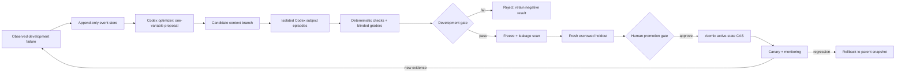

# Architecture — governed stateful evolution

- **Version:** 1.0
- **As of:** 2026-07-29
- **Decision:** Build a bounded, event-sourced context-evolution loop; do not allow an agent to mutate policy, evaluation controls, or active production state directly.

## System map

The loop evolves a context snapshot. Code, immutable policy, authority rules, runtime settings, graders, thresholds, and holdouts remain outside the mutable boundary.

## State layers

| Layer | Contents | Writer | Evaluation visibility |
| --- | --- | --- | --- |
| L0 | Human-owned policy and authority | Named human only | All roles receive the applicable hash and rules |
| L1 | Frozen model, CLI, tools, and runtime | Evaluation owner | Subject and harness |
| L2 | Evidence and claim ledgers | Governed research workflow | Optimizer receives cited development evidence |
| L3 | Approved durable context | Atomic promotion gate | Retrieval-only and evolving subjects |
| L4 | Candidate context branch | Codex may propose; harness validates | Candidate condition only |
| L5 | Episode scratch and task context | Subject agent | One isolated episode; discarded afterward |
| L6 | Private holdout and grader state | Evaluation owner | Graders/harness only; never optimizer |
| L7 | Reports and dashboard projections | Deterministic builders | Read-only derived view |

Only one L3 snapshot is active. L4 cannot enter ordinary work before a fresh holdout and human approval. L0 and L6 are never agent-mutable.

## Event store

SQLite in WAL mode is the canonical runtime state because an append-only text file plus atomic replacement cannot prevent concurrent lost updates. Each stream append uses `BEGIN IMMEDIATE`, an expected stream version, and a unique idempotency key.

Every event records:

- event, stream, iteration, run, candidate, actor, and session identity;
- correlation and causation IDs;
- base context, surface, and policy snapshot identities;
- payload and input/output artifact references;
- previous event hash and current event hash;
- occurrence and recording timestamps.

Duplicate idempotency keys with the same event content return the original event. Conflicting duplicates are quarantined as errors; last-write-wins is forbidden. Deterministic JSONL exports support repository review but are not the write path.

## Content-addressed artifacts

Prompts, outputs, traces, context packs, proposals, plans, scores, and reports are stored at `artifacts/sha256/<prefix>/<sha256>`. Database rows reference the digest. This makes provenance stable even when a human-readable export is regenerated.

## Context entries

Each mutable entry has:

- kind: fact, preference, procedure, lesson, or constraint;
- explicit domain, task-tag, and surface scope;
- source event IDs and evidence state;
- confidence, priority, owner, and sensitivity;
- authority effect (`none` is required for agent-proposed entries);
- valid-from, expiry, and refresh trigger;
- supersession links and lifecycle status.

Changes are additive operations: add, supersede, or retire. In-place mutation is forbidden. Volatile entries require expiry or a refresh trigger. Restricted content, credential-like values, holdout-derived sources, and authority-changing entries fail before candidate creation.

## Context compilation

The compiler selects only active, unexpired, surface-compatible, and scope-compatible entries. It ranks exact domain and tag matches before general entries, then priority, confidence, and freshness. A fixed entry and character budget prevents silent context growth.

Every compilation persists a trace containing included and excluded entry IDs, reasons, order, size, source snapshot, task identity, and final pack hash. This makes retrieval itself evaluable.

## Role isolation

- **Subject:** sees one condition packet and one synthetic episode; never workflow identity.
- **Optimizer:** sees development failures and accepted evidence only; never holdout material or grader rationale from holdout.
- **Grader:** sees anonymous outputs and task checks; never condition, state, or prompt provenance.
- **Adjudicator:** sees only disagreements and the frozen rubric.
- **Human owner:** alone can authorize provider cost, reveal holdout, promote, change policy, or waive rollback.

Fresh ephemeral Codex processes and separate artifact packets prevent state from leaking through conversation history.

## Promotion and rollback

The harness can classify a candidate as eligible for holdout or human review; it cannot activate it by model judgment. Activation requires a full-study summary with every gate true, human-final evidence, a fresh sealed holdout that was hidden from the optimizer and marked spent after reveal, completed candidate-canary evidence, tested rollback evidence, and an unexpired named-human approval. The transition uses compare-and-swap against the expected active snapshot and version. The accepted snapshot points to its parent as the rollback target. Rollback accepts only a prior accepted ancestor and is another human-approved recorded state transition, never deletion.

A revealed holdout becomes spent and joins the regression bank. Any later candidate needs a fresh escrowed holdout.

## Principal failure modes

- benchmark or memory contamination;
- evaluator self-preference and correlated graders;
- authority drift disguised as optimization;
- stale context, failed supersession, or missing deletion;
- concurrent lost updates or duplicate execution;
- retry selection bias and metric gaming;
- context bloat, latency, and irrelevant retrieval;
- runtime drift or unrecorded tool changes;
- promotion from provisional grades;
- rollback without provenance.

Each appears as an explicit fixture family, metric, invariant, or stop rule in `PROTOCOL.md`.
